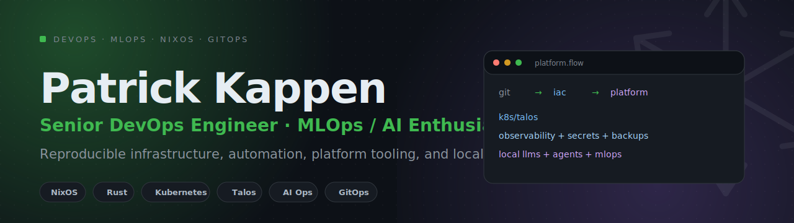

<div align="center">



<br><br>

<a href="https://github.com/Patrick-Kappen/graft"></a>


<br><br>

**Senior DevOps Engineer · MLOps / AI enthusiast · NixOS tinkerer**

I build reproducible infrastructure, GitOps platforms, automation workflows,
MLOps tooling, and local-first developer environments.

</div>

---

## About me

I am a Senior DevOps Engineer from the Netherlands with a strong focus on
infrastructure automation, platform engineering, observability, and AI/MLOps
workflows.

I like systems that are predictable, reviewable, reproducible, and recoverable.
If something matters, it should not depend on manual clicking, tribal knowledge,
or hidden state.

> No clicky-click infrastructure. If it matters, it should be declarative,
> versioned, tested, observable, and recoverable.

---

## What I build

- Infrastructure as Code and GitOps workflows
- Kubernetes, Talos, Nomad, Docker, Podman, and container platforms
- CI/CD pipelines for infrastructure and application delivery
- MLOps and AI platform tooling
- Observability stacks for systems, applications, and LLM workflows
- Reproducible NixOS workstations and servers
- Rust, Python, shell, PowerShell, and TypeScript tooling for automation
- Homelab infrastructure that mirrors real production patterns

---

## Featured project: Graft

[Graft](https://github.com/Patrick-Kappen/graft) is my current main open-source
project.

Graft is a TOML-driven workflow for building Podman Quadlet containers from the
Nix store.

```text
TOML
  ↓
Graft CLI
  ↓ JSON stdout
NixOS / Home Manager
  ↓
rootfs from the Nix store
  ↓
Podman Quadlet
  ↓
systemd service
```

It focuses on:

- no container images for the `rootfs-store` flow
- no ad-hoc package installs inside containers
- declarative packages through Nix
- NixOS system/rootful containers
- Home Manager user/rootless containers
- Podman Quadlet output
- reproducible local developer environments

Current alpha release:

```text
v0.1.0-alpha.1
```

---

## Active stack

<div align="center">


</div>

<details open>
<summary><strong>DevOps / platform engineering</strong></summary>

### Cloud and platforms

- Azure
- AWS
- IBM Cloud
- on-prem / datacenter environments
- Proxmox
- TrueNAS
- NixOS
- macOS

### Containers and orchestration

- Kubernetes
- Talos Linux
- Docker
- Docker Swarm
- Podman
- Podman Quadlet
- Nomad
- Helm
- GitOps workflows
- Argo CD / GitOps-style deployment flows

### Infrastructure as Code

- Terraform
- OpenTofu
- Bicep
- ARM templates
- Ansible
- YAML-heavy platform configuration
- Python automation
- PowerShell automation
- Bash scripting
- TypeScript tooling
- unit tests, linters, validation, and policy checks

### CI/CD

- GitHub Actions
- Azure DevOps
- Jenkins
- Forgejo
- infrastructure-focused pipelines

</details>

<details open>
<summary><strong>Observability</strong></summary>

I care a lot about being able to understand what systems are doing.

Tools and patterns I work with include:

- Grafana
- Prometheus
- Loki
- OpenTelemetry
- Datadog
- Splunk
- Azure Monitor / Log Analytics
- Langfuse
- Phoenix
- metrics, logs, traces, and LLM observability

</details>

<details open>
<summary><strong>Security and secrets</strong></summary>

I prefer secrets and access patterns that are explicit, auditable, and
automated.

Experience includes:

- Infisical
- Azure Key Vault
- SOPS
- age
- Vault / Vault-style secret workflows
- Terraform-managed secrets
- GitOps-safe secret handling
- least-privilege infrastructure patterns

</details>

---

## MLOps / AI

I am actively exploring and building around AI and MLOps systems.

Areas I work with or experiment with:

- local LLM stacks
- hosted LLM APIs
- OpenAI
- Anthropic Claude
- Azure AI / Azure OpenAI-style workflows
- IBM Cloud AI tooling
- Hugging Face
- Ollama
- llama.cpp
- vLLM
- LiteLLM
- Bifrost
- LangGraph
- Langfuse
- Phoenix
- vector databases
- retrieval workflows
- BM25 and hybrid search
- agent tooling and SDKs

I am especially interested in the intersection of:

```text
infrastructure automation
  +
developer tooling
  +
local-first systems
  +
AI-assisted workflows
```

---

## Databases and storage

Experience includes:

- PostgreSQL
- Microsoft SQL Server
- MySQL
- MongoDB
- Redis
- Qdrant
- vector search
- BM25 / hybrid retrieval patterns
- NAS and backup architecture

---

## Homelab

I run a homelab that is managed like real infrastructure, not like a pile of
manually configured machines.

```text
Internet
  ↓
Firewall / DDNS / DNS
  ↓
Traefik / identity / service entrypoints
  ↓
Kubernetes / Talos / Nomad / devcontainers
  ↓
Observability / secrets / automation
  ↓
TrueNAS / Proxmox Backup Server / 3-2-1 backups
```

Current themes:

- TrueNAS with mirrored storage
- Proxmox
- Proxmox Backup Server
- 3-2-1 backup strategy
- multiple servers
- 10Gbit backplane
- Talos and Kubernetes
- Nomad
- Ansible
- OpenTofu
- GitOps
- devcontainers
- monitoring with Prometheus, Grafana, Loki, and Kuma
- high-availability DNS with Technitium
- Traefik
- Authentik / Keycloak-style identity flows
- DDNS
- firewalling
- self-hosted services such as Nextcloud

Most of it is declarative, automated, and versioned where possible.

---

## Workstation

My daily setup is built around reproducibility and terminal-first workflows.

- NixOS
- Home Manager
- Niri
- macOS
- Kitty
- tmux
- Neovim
- Git
- shell-first automation

---

## Engineering principles

- Declarative over manual
- GitOps over clickops
- Reproducible over mutable
- Explicit state over hidden state
- Small tools over giant black boxes
- Observability from the start
- Automation with tests, linters, and validation
- Local-first where possible
- Recovery plans matter as much as deployment plans

---

## Currently interested in

- NixOS as a platform for real infrastructure
- rootfs-based containers
- Podman Quadlet
- MLOps observability
- local LLM infrastructure
- AI agents for developer workflows
- reproducible developer environments
- secure GitOps workflows
- homelab-to-production patterns

---

## Contact

The best place to reach me for now is GitHub.

I am gradually publishing reusable parts of my private infrastructure and tooling
as open-source projects.
