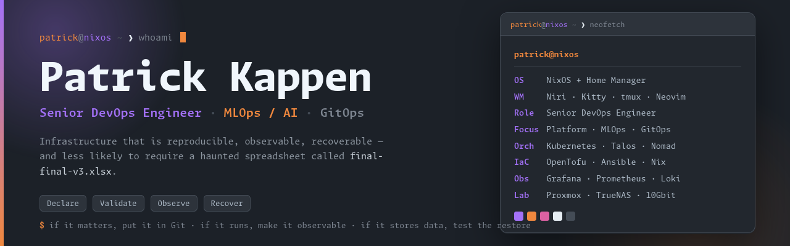
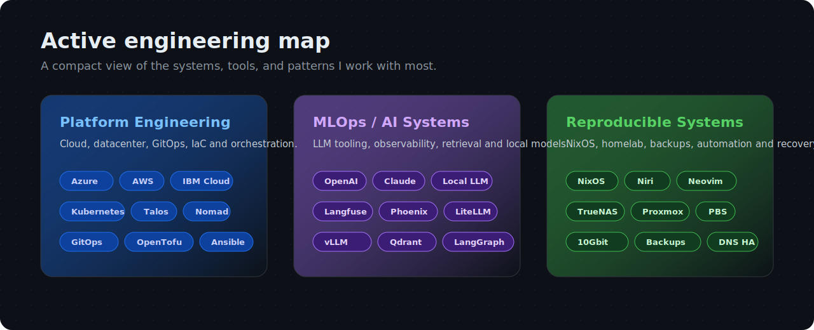
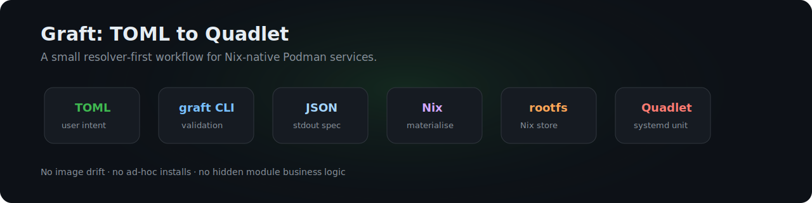

<div align="center">



<br><br>

<a href="https://github.com/Patrick-Kappen/graft"></a>


<br><br>

**Senior DevOps Engineer · MLOps / AI enthusiast · NixOS tinkerer**

I build reproducible infrastructure, GitOps platforms, automation workflows,
MLOps tooling, and local-first developer environments.

</div>

---

## About me

I am a Senior DevOps Engineer from the Netherlands. My work lives around
infrastructure automation, platform engineering, observability, and AI/MLOps
systems.

I like infrastructure that is boring in production and interesting in design:
declarative, versioned, tested, observable, and recoverable. I prefer systems
where the desired state is reviewable in Git and where recovery is part of the
architecture, not an afterthought.

> No clicky-click infrastructure. If it matters, it should be declarative,
> versioned, tested, observable, and recoverable.

---

## Active engineering map



I usually work where infrastructure, developer workflows and AI systems meet:
platforms that need to be automated, observable and recoverable, but still nice
to work on every day.

**Platform engineering:** cloud, datacenter and self-hosted platforms built
around IaC, GitOps, orchestration, CI/CD, secrets, policy checks and monitoring.

**MLOps / AI systems:** local models, hosted APIs, routing layers, retrieval,
agent tooling, traces, evaluation loops and observability for AI workflows.

**Reproducible systems:** NixOS, Home Manager, homelab automation, backup
strategy, rootfs-based containers, recovery flows and local-first tooling.

---

## Featured project: Graft

[Graft](https://github.com/Patrick-Kappen/graft) is my current main open-source
project.

Graft is a TOML-driven workflow for building Podman Quadlet containers from the
Nix store. The goal is to keep container intent small and readable while letting
Nix materialise the rootfs and Quadlet output.



**Why it exists:** I want development and service containers that are declared
like infrastructure. Packages come from Nix, runtime output is generated, and
the user does not hand-write Quadlet boilerplate or install tools ad-hoc inside
containers.

**Current alpha:** `v0.1.0-alpha.1`

Current scope: TOML to JSON resolver, NixOS system containers, Home Manager user
containers, rootfs-store materialisation, `graft-pause`, CI and docs.

---

## Stack snapshot

This is the compact version of the stack I actively work with or experiment
with. The long version changes often; the themes do not.

**Cloud and platforms**
`Azure` · `AWS` · `IBM Cloud` · `datacenter` · `Proxmox` · `TrueNAS` · `NixOS` · `macOS`

**Containers and orchestration**
`Kubernetes` · `Talos` · `Docker` · `Swarm` · `Podman` · `Quadlet` · `Nomad` · `Helm` · `GitOps`

**IaC and automation**
`OpenTofu` · `Terraform` · `Bicep` · `ARM` · `Ansible` · `Python` · `PowerShell` · `Bash` · `TypeScript`

**CI/CD and quality**
`GitHub Actions` · `Azure DevOps` · `Jenkins` · `Forgejo` · `unit tests` · `linters` · `policy checks`

**Observability**
`Grafana` · `Prometheus` · `Loki` · `Datadog` · `Splunk` · `OpenTelemetry` · `Azure Monitor` · `Langfuse` · `Phoenix`

**Secrets and security**
`Infisical` · `Azure Key Vault` · `SOPS` · `age` · `Vault-style workflows` · `least privilege` · `GitOps-safe secrets`

**MLOps and AI**
`OpenAI` · `Claude` · `Azure AI` · `IBM Cloud AI` · `Hugging Face` · `Ollama` · `llama.cpp` · `vLLM` · `LiteLLM` · `Bifrost` · `LangGraph`

**Data and retrieval**
`PostgreSQL` · `SQL Server` · `MySQL` · `MongoDB` · `Redis` · `Qdrant` · `vector search` · `BM25` · `hybrid retrieval`

---

## MLOps / AI

I am especially interested in the practical side of AI systems: how models,
retrieval, prompts, traces, evaluations, routing, local inference and production
infrastructure fit together.

**Local-first AI:** Ollama, llama.cpp, vLLM and local model stacks for
experimentation, privacy, latency and control.

**AI platform tooling:** LiteLLM, Bifrost, LangGraph, SDKs, hosted LLM APIs and
routing layers that make AI workflows operable.

**Observability:** Langfuse, Phoenix, OpenTelemetry-style thinking, traces,
evaluation loops and visibility into what AI systems are actually doing.

```text
infrastructure automation
  + developer tooling
  + local-first systems
  + AI-assisted workflows
```

---

## Homelab

I run a homelab that is managed like real infrastructure, not like a pile of
manually configured machines. It is where I test platform ideas, GitOps flows,
backup strategies, HA patterns and AI infrastructure before they become muscle
memory.


**Platform shape:** Proxmox, Talos, Kubernetes, Nomad, devcontainers, GitOps,
Ansible and OpenTofu. The goal is to keep services reproducible and rebuildable
instead of precious snowflakes.

**Reliability shape:** TrueNAS mirrors, Proxmox Backup Server, 3-2-1 backups,
10Gbit backplane, Technitium DNS HA, monitoring, alerting and recovery-oriented
design.

Services and patterns include Traefik, Authentik / Keycloak-style identity,
Nextcloud, DDNS, firewalling, Prometheus, Grafana, Loki, Kuma and more.

---

## Workstation

My daily setup is terminal-first and declarative where possible.

`NixOS` · `Home Manager` · `Niri` · `macOS` · `Kitty` · `tmux` · `Neovim` · `Git`

The goal is a machine that can be rebuilt, understood, versioned and tuned
without turning the workstation into undocumented state.

---

## Engineering principles

**Declarative first:** if it matters, it belongs in config. I prefer reviewable
desired state over manual changes and hidden drift.

**Observable by default:** logs, metrics, traces and health signals should be
part of the design, not a panic-driven retrofit.

**Recovery matters:** backups, rebuilds and rollback paths are as important as
deployment pipelines. A system is not done until it can recover.

**Small tools, clear boundaries:** I like tools that do one job clearly and can
be composed into bigger workflows without hiding state.

---

## Currently exploring

`NixOS as infrastructure` · `rootfs-based containers` · `Podman Quadlet` ·
`reproducible developer environments` · `secure GitOps` · `local LLM stacks` ·
`MLOps observability` · `AI agents for developer workflows` ·
`homelab-to-production patterns`

---

## Compact reference

<details>
<summary><strong>Expanded tool keywords</strong></summary>

<br>

**Cloud:** Azure, AWS, IBM Cloud, datacenter
**Orchestration:** Kubernetes, Talos, Docker, Swarm, Podman, Nomad, Helm
**IaC:** OpenTofu, Terraform, Bicep, ARM, Ansible, YAML-heavy platform config
**CI/CD:** GitHub Actions, Azure DevOps, Jenkins, Forgejo
**Languages:** Python, Rust, Bash, PowerShell, TypeScript, HTML, CSS, PHP
**Observability:** Datadog, Grafana, Splunk, OpenTelemetry, Prometheus, Loki, Azure Monitor, Langfuse, Phoenix
**Security:** Infisical, Azure Key Vault, SOPS, age, Vault-style workflows
**AI/MLOps:** Langfuse, LangGraph, LiteLLM, Bifrost, Phoenix, Ollama, llama.cpp, vLLM, Hugging Face, local LLMs
**Data:** PostgreSQL, SQL Server, MySQL, MongoDB, Redis, Qdrant, vector search, BM25
**Homelab:** TrueNAS, Proxmox, PBS, 3-2-1 backups, 10Gbit, Technitium DNS HA, Traefik, Authentik, Nextcloud

</details>

---

## Contact

The best place to reach me for now is GitHub.

I am gradually publishing reusable parts of my private infrastructure and tooling
as open-source projects.
