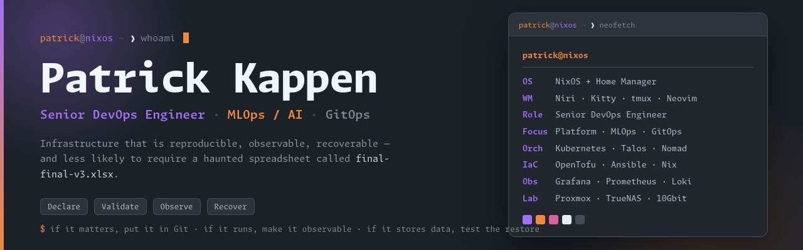
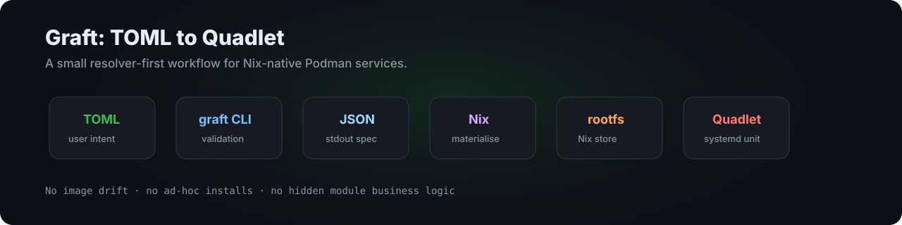

   

   **Platform & security engineer · Azure · Terraform · GitHub · Entra · Nix · AI
 infrastructure**

   Every change reviewed. Nobody over-privileged. Humans or agents.

   [patrick.kappen.io](https://patrick.kappen.io)

   

   ---

   I build platforms and the tooling around them: identity, delivery, recovery and
   AI infrastructure, all as code. I write the automation myself, in Terraform,
   Bicep, PowerShell, Python, TypeScript, Rust and Nix, and I care about what
   happens after the deploy: can it be reviewed, observed, restored?

   ## At work: SLTN

   Senior DevOps Engineer at **SLTN**, a Dutch Azure Expert MSP and CSP. I own the
   platform code that our cloud teams and customer tenants run on, and work with
   the CISO on turning security policy into automation.

   - **Azure DevOps → GitHub**: migrating repositories, pipelines and governance for the
 whole organisation.
   - **Secrets → OIDC**: workload identity federation for every pipeline; no stored
 credentials.
   - **Least privilege at CSP scale**: GDAP, Azure Lighthouse and PIM/JIT, defined in
 Terraform.
   - **GitHub and Entra as code**: organisations, repositories, apps and access in
 Terraform.
   - **Automated landing zones**: standardised, policy-checked customer environments.
   - **Recovery you can prove**: automated Azure Site Recovery drills in GitHub Actions:
 test failover,
     agent and network checks, reporting and guaranteed cleanup.

   ## AI infrastructure

   - **Open models as coding agents**: selecting, benchmarking and tuning open-weight models
 for
     agentic coding. Model screening across candidates, a production profile backed by
 measured
     numbers, and serving on vLLM with INT4 quantisation, speculative decoding and KV-cache
 tuning.
   - **Benchmarks that match the work**: my own suite for tool calling, multi-step agent
 tasks,
     long-context retrieval, coding quality and concurrent agents, so model choices follow
 the
     workload rather than the leaderboard.
   - **Upstream-minded**: vLLM diagnostics patches and issue reports from what the
 benchmarks turn up.
   - **Agents with boundaries**: sandboxed execution (bubblewrap), scoped credentials,
 human-approved Git
     promotion, and declarative agent profiles built with Nix.
   - **Operable AI**: routing (LiteLLM), local inference (Ollama, llama.cpp), traces and
 evaluation (Langfuse, Phoenix).

   ## Platform & homelab

   A homelab run like production: Proxmox, Talos Kubernetes, Nomad, GitOps, OpenTofu and
 Ansible;
   TrueNAS, Proxmox Backup Server and 3-2-1 backups on a 10 Gbit backplane; Prometheus,
 Grafana and Loki.

   My workstations and servers are a NixOS fleet with sops-nix secrets and SSH-signed
 commits,
   built from Git and designed so that a compromised GitHub account cannot reach it.

   ### Graft

   [Graft](https://github.com/Patrick-Kappen/graft): TOML-driven Podman Quadlet
   containers, built from the Nix store. Small, readable container intent; Nix
   builds the rootfs and the Quadlet units.

   

   ## Toolbox

   **Cloud** Azure · IBM Cloud · AWS · Proxmox
   **IaC & delivery** Terraform/OpenTofu · Bicep · GitHub Actions · Azure DevOps · Ansible ·
 Nix
   **Identity & security** Entra ID · PIM/JIT · GDAP · Lighthouse · OIDC · Key Vault · SOPS
   **Containers** Kubernetes · Talos · Podman/Quadlet · Docker · Helm
   **Code** PowerShell · Python · TypeScript · Rust · Bash
   **AI** vLLM · Ollama · llama.cpp · LiteLLM · LangGraph · Langfuse · Phoenix

   ## Principles

   - **Reviewed, then applied.** Plan or what-if in the pull request, approval, then deploy.
   - **No standing access.** Identities, people and agents alike, get just enough rights,
 just in time.
   - **Recovery is part of the design.** A platform is done when it can be rebuilt and
 restored.

   ## Certifications

   AZ-900 · AZ-104 · AZ-400
   Working towards: GitHub Actions · GitHub Administration · AI-103 (Azure AI Apps and
 Agents)
