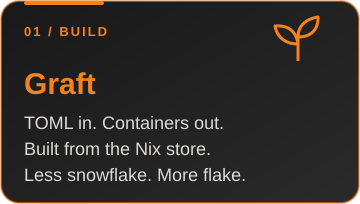
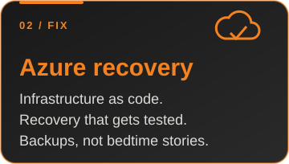
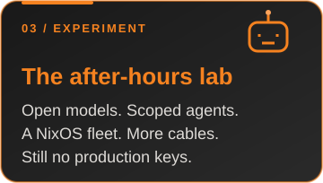

<!-- markdownlint-disable MD013 MD033 -->

<p align="center">
  
</p>

# Hey, I'm Patrick 👋

**I build the platforms other people deploy to.**
At home, I recreate the same problems with my own electricity bill.

<p>
  <a href="https://patrick.kappen.io"><strong>🌍 Website</strong></a> &nbsp;·&nbsp;
  <a href="https://patrick.kappen.io/blog/">✍️ Blog</a> &nbsp;·&nbsp;
  <a href="https://www.linkedin.com/in/patrick-kappen/">💬 LinkedIn</a> &nbsp;·&nbsp;
  <a href="https://patrick.kappen.io/rss.xml">📡 RSS</a>
</p>

Senior DevOps, AI and security engineer at **SLTN**, an Azure Expert MSP.
My day job is Azure, identity and delivery as code: fewer portal clicks,
fewer standing admins, fewer secrets hiding in pipelines.

After hours: NixOS, a homelab with production ambitions, and open-weight
coding agents. The agents get a sandbox and a reviewer. Not the keys.

```nix
patrick = {
  infrastructure = "as code";
  agents.productionKeys = false;
  restores = "actually tested";
  "just-one-more-server" = true;
};
```

## 🛠️ Things I'm building, fixing & occasionally overengineering

<p align="center">
  <a href="https://github.com/Patrick-Kappen/graft"></a>
  <a href="https://github.com/Azure/terraform-azurerm-avm-res-recoveryservices-vault/pull/271"></a>
  <a href="https://patrick.kappen.io/setup/"></a>
</p>

<details>
<summary><strong>📋 House rules (yes, the robots have to read these too)</strong></summary>

- **If it's not in Git, it doesn't exist.** Portal clicks are drift with extra steps.
- **Standing admin access is a bug.** Permissions should have an expiry date.
- **AI agents get the intern treatment.** A sandbox, a reviewer, no production keys.
- **Boring in production, interesting in design.** The exciting part should be the pull request.

I've watched an automated PR merge a feature, revert it, and still announce it
in the release notes. So yes, there is a reviewer.

</details>

<!-- auto:start -->

## 📊 The Git log

[](https://github.com/Patrick-Kappen?tab=overview)

### 🚢 Recently shipped

- 🐛 **[Parse X11 displays that start with / or unix: as libxcb 1.16 does](https://github.com/MichaelKinsy/PiG/pull/424)**<br><sub>MichaelKinsy/PiG · Nov 2026</sub>
- 🐛 **[Parse X11 displays that start with / or unix: as libxcb 1.16 does (upstream #424)](https://github.com/Patrick-Kappen/PiG/pull/14)**<br><sub>PiG · Nov 2026</sub>
- ✨ **[Keep Nix builds from updating themselves](https://github.com/Patrick-Kappen/paseo/pull/3)**<br><sub>paseo · Nov 2026</sub>

## 📡 Currently on the workbench

- Studying for GitHub Actions and AI-103
- Building a blog on patrick.kappen.io

_Updated Oct 2026. Side quests subject to change._

## ✍️ Notes from the rabbit hole

- [Contributing to a Terraform provider: preparation](https://patrick.kappen.io/blog/contributing-to-a-terraform-provider-preparation/)
- [Two GitHub accounts, one machine, zero switching](https://patrick.kappen.io/blog/two-github-accounts-by-directory/)

<!-- auto:end -->

<!-- site:start -->

## 🧰 Things I reach for

<p>
   &nbsp;
   &nbsp;
   &nbsp;
   &nbsp;
   &nbsp;
   &nbsp;
   &nbsp;
   &nbsp;
   &nbsp;
   &nbsp;
</p>

<details>
<summary><strong>The longer version, including the certificates</strong></summary>

### Toolbox

- **Cloud:** Azure
- **Automation & delivery:** Terraform · Bicep · GitHub Actions · PowerShell ·
  Azure DevOps · Ansible
- **NixOS & deployment:** NixOS
- **Linux:** Ubuntu
- **Containers & orchestration:** Kubernetes · Podman
- **AI:** LiteLLM · Phoenix
- **Datacenter & virtualisation:** Proxmox
- **Networking:** Tailscale · Traefik
- **Storage & backup:** TrueNAS
- **Monitoring:** Grafana

### Certifications

- **Certified:**
  [AZ-900](https://www.credly.com/badges/c864e7a2-1536-4183-9e0c-c5cd841b2088) ·
  [AZ-104](https://www.credly.com/badges/103f1099-a80a-4544-8c95-45b80edbf2ad) ·
  [AZ-400](https://www.credly.com/badges/5bd5f444-199c-4ee5-8177-43427a8ad8ce)
- **Working towards:** GitHub Actions · AI-103

</details>

<!-- site:end -->

---

<sub>Every change reviewed. Every restore tested. Every “quick experiment” suspicious.</sub>

<!-- markdownlint-enable MD013 MD033 -->
